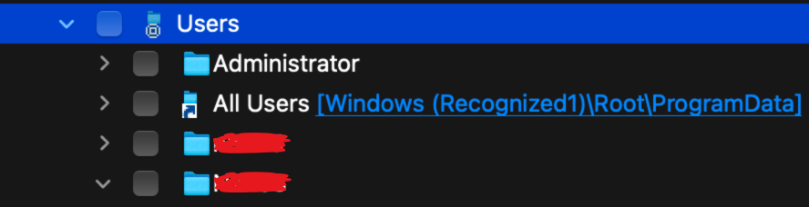
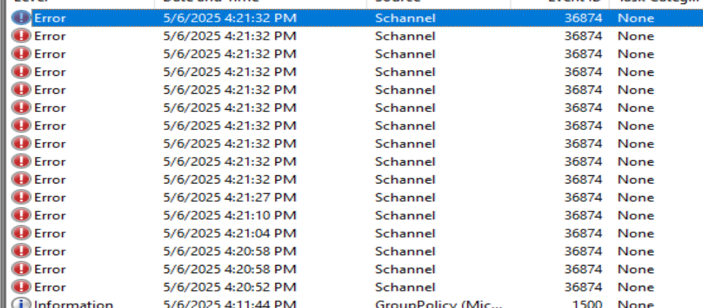

# Forensic SSD Triage – Redacted Case Report

⚠️ This is a redacted case study based on a real forensic investigation conducted during a cybersecurity internship.  
All identifying information (e.g., user names, domains, asset tags) has been removed or obfuscated for public sharing.  
This documentation follows NIST 800-61 guidelines and was created for educational and professional development purposes.

---

## Case Summary

HP Z2 SFF G4 Workstation was issued to a LAPD detective which then began showing instability and prompted Blue Screen of Death (BSOD). The machine was submitted to our team for forensic triage to determine if the system was compromised, what activity led to the failure, and whether malicious or unauthorized software was involved.

The device in question was the **third machine** assigned to this user. Colleagues had previously expressed concerns about their habitual clicking of suspicious links and disregard for cybersecurity best practices. Given the context and the potential risk to the department I initiated a thorough investigation.

---

## 🖥️ Device Metadata

| Attribute        | Detail                       |
| ---------------- | ---------------------------- |
| Asset Tag        | PD******                     |
| Device Type      | HP Desktop                   |
| OS               | Windows (version redacted)   |
| Primary User     | `UserA` – C******* R******** |
| Secondary User   | `UserB` – E**** R****        |
| Other Users      | `Administrator`, `All Users` |
| Last Seen Online | June 25, 3:51 PM             |

---
 

## Forensic Setup

| Element             | Value                             |
| ------------------- | --------------------------------- |
| Analyst Workstation | Intel MacBook Pro (2019)          |
| Forensic OS         | Kali Linux (VM)                   |
| Adapter Used        | USB-C to SATA                     |
| Access Mode         | Read-Only (write blocker enabled) |
| Network Status      | Offline (Wi-Fi disabled)          |

To ensure forensic soundness, the SSD was accessed in **read-only mode**  Network interfaces were disabled to prevent any malware spreads or backdoor communication attempts.

---

## Initial Observations

Upon mounting the SSD the following observations were made:

* Device suffered from multiple **BSODs**, with error logs showing **critical kernel failures**.
* Our Focus was placed on **System** and **Application logs**, correlating crash times with known suspicious behavior.
* These Logs revealed key activity on **May 15**, **March 24**, and **January 23** — flagged as critical dates for system behavior.

---

## Event Log Analysis

Analyzed via `eventvwr.msc` and offline log extraction:

### Key Findings

* **May 15, 8:53–9:00 AM**: User `UserA` was logged in and using **Microsoft Edge**.
* **Accessed domain**: `conductorhimselfwhipped[.]com`

  * Flagged by **Malwarebytes** as a suspicious domain
  * When sandboxed, the link resolved to a fake Google homepage and later an error page (See image "error_code.png")
 
* **SCHANNEL errors**: Multiple TLS/SSL handshake failures were logged on May 6th around 4:21PM, likely due to malformed or spoofed HTTPS requests
* **System freeze** followed by BSOD

---

## Cookie Investigation

To further explore evidence of domain access and user behavior:

1. **RStudio** was used to search all `.sqlite` files across the mounted SSD.
2. Manually reviewed each SQLite file using `beta.sqliteviewer.app`.
3. Prioritized files:

   * `Cookies`
   * `History`
   * `Web Data`

**Path of interest**:
*See Images ,  , , , and  for path contents

### Results

The files relating to web browing were not found. However, these sqlite files were examined for additional evidence, but nothing of note was found.

---

## Antivirus & Threat Detection

| Tool         | Result                                    |
| ------------ | ----------------------------------------- |
| Malwarebytes | Blocked the domain at time of click       |
| SentinelOne  | Not installed during the time of incident |

Malwarebytes was the active AV at the time. The alert was confirmed via **URLScan.io**, which showed:

* Domain was flagged as suspicious
* Possibility of visual content impersonating legitimate websites
* See images for report : "urlscan1.png", and "urlscan2.png"
---
[urlscan1](../evidence/urlscan1.png)
[urlscan2](../evidence/urlscan2.png)

## Timeline of Events

| Date   | Event Description                            |
| ------ | -------------------------------------------- |
| Jan-Jun| Suspicious system errors logged              |
| May 6  | SCHANNEL and Edge-related anomalies          |
| May 15 | Clicked flagged domain; system freeze & BSOD |
| Jun 25 | Last time device was online (3:51 PM)        |

---

## ✅ Conclusions (So Far)

* The user `UserA` was directly involved in the activity that led to the BSOD.
* The domain `conductorhimselfwhipped[.]com` was confirmed suspicious and accessed by the user.
* Logs, and AV Logs confirm user interaction with a malicious or malformed site.
* Behavior is consistent with **malicious code execution** or **unauthorized software triggering system faults**.

---

## 🛠️ Recommended Action

This machine should be:

* **Reimaged** with the latest LAPD-approved Windows image
* Re-provisioned with **SentinelOne EDR installed**
* Retired from further investigation unless hard evidence requires disk imaging

⚠️ This is the third device assigned to the same user. Recommendation:

* Conduct a user privilege and behavior audit and limit unwanted sites
* Enforce browser access policies and EDR visibility
* Consider internal escalation or further review

---

## 🔖 Notes

* All screenshots and logs are stored in `/evidence/`
* No evidence was altered during investigation
* Investigation followed **NIST 800-61** incident response guidance
* All tool usage was done offline and in a controlled sandboxed enviroment

---

*Compiled and analyzed by: Nigel, Frank, and Chalmers (SOC Analysts)*

*University of Oregon – LAPD Cybersecurity Summer Intern 2025*
